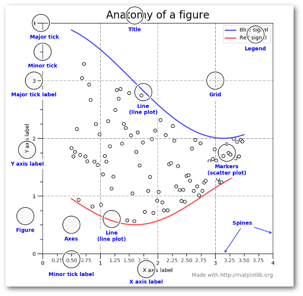

# Data Visualization with Matplotlib & Seaborn

### Objectives

>>* Matplotlib and the building blocks of data visualizations
* Seaborn plotting fundamentals and styles
* Which visualizations to use in different scenarios
* Example code for common charts and diagrams

### Review 

Below is a brief review of the key points about data visualization & storytelling from the "Data Science Foundations" section.

* Visualizations serve to quickly explain features and conclusions about data to your stakeholders.
* As such, they should be *simple*, *uncluttered*, and *clearly labeled*. Less is more.
* Visual considerations include position, color, order, & size.
* The best visualizations tell a story about the data by illustrating key points supporting your thesis and conclusions.
* Most importantly, *consider your audience* when crafting your story.
* The chart type you select should accurately represent the variables you are pulling from data in a way that is clearly readable for your audience.



## Common Charts by Use Case

Choosing the right chart to visualize parts of your data is somewhat subjective. It hinges mainly on:
* The type of data you have
* The message you're trying to convey

**The goal is always to convey your message in the clearest, cleanest way possible.** For reference here is a breakdown of which charts are commonly used to illustrate different statements and/or relationships:


...


## Import & Set Up Libraries

```python
import numpy as np
import pandas as pd

import matplotlib.pyplot as plt
%matplotlib inline # specific to Jupyter Notebooks & Colab*
import seaborn as sns

print('import successful')
```

*`%matplotlib inline` tells Python to draw the figure inline with the code as opposed to making it available only as a downloadable .png file.

## Matplotlib Overview


## Seaborn Overview

    ### Color Palettes
    ### Figure Styles

## Bar Charts

categorical data or discrete time series data (like months?)

    ### Vertical

    ### Horizontal

    ### Grouped

    ### Stacked

## Box & Whiskers Plots (Distributions)

sns.boxplot(x='diagnosis', y='area_mean', data=df)

## Violin Plots (Distributions)

## Histograms

- Effective for distribution across groups.


- Histograms are useful when you want to see how your data are distributed across groups. Important: histograms are not the same thing as a bar chart! Histograms look similar to bar charts, but with bar charts, each column represents a group defined by a categorical variable; and with histograms, each column represents a group defined by a continuous, quantitative variable.
- One implication of this distinction: with a histogram, it can be appropriate to talk about the the tendency of the observations to fall more on the low end or the high end of the X axis.
- With bar charts, however, the X axis does not have a low end or a high end; because the labels on the X axis are categorical - not quantitative.

## Bar Chart vs Histogram

The main difference between a bar chart and histogram is that histograms are used to show distributions of variables while bar charts are used to _compare_ variables.


## Scatterplots

    ### Color-Coded Scatterplots

    ### Swarmplots: Categorical Scatterplots

    ### Adding Marginal Distributions


### Linear Regression


## Resources

* [44 Types of Graphs](https://visme.co/blog/types-of-graphs/)
* [8 Tips for Great Data Viz](https://www.gooddata.com/blog/8-ways-turn-good-data-great-visualizations)
* [Python Graph Gallery](https://python-graph-gallery.com/)
* [Data to Viz Interactive Diagram](https://www.data-to-viz.com/#explore)
* [How to Set a Color w. Matplotlib](https://python-graph-gallery.com/196-select-one-color-with-matplotlib/)
* [Python Colors & Color Palettes](https://python-graph-gallery.com/python-colors/)
* [Data to Viz Visualization Style Tips](https://www.data-to-viz.com/caveats.html)
