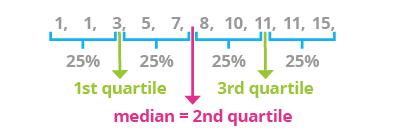

# (EDA)

## Objectives

>>* basic stats concepts
	>>* distributions
	>>* measures of central tendency
	>>* 
>>* groupby
>>* basic descriptive stats
    >>* sampling
    >>* correlation
    >>* relative frequencies with groupby
    >>* tbd

>>relative frequencies
https://towardsdatascience.com/getting-more-value-from-the-pandas-value-counts-aa17230907a6
>>correlation?
>>word frequency in the plot col?

### Import

```python
import pandas as pd
import numpy as np
from scipy import stats
import matplotlib.pyplot as plt
%matplotlib inline
import seaborn as sns

print('import successful')
```

Load the data with `imdbID` as the index and make a copy.

```python
omdb_orig = pd.read_csv('https://raw.githubusercontent.com/mottaquikarim/pycontent/master/content/raw_data/omdb4500_eda.csv', index_col='imdbID')
movies = omdb_orig.copy()
print('data loaded successfully')
```

Min: The smallest value in the column
Max: The largest value in the column
Quartile: A quartile is one fourth of our data
First quartile: This is the bottom most 25 percent
Median: The middle value. (Line all values biggest to smallest - median is the middle!) Also the 50th percentile
Third quartile: This the the top 75 percentile of our data

