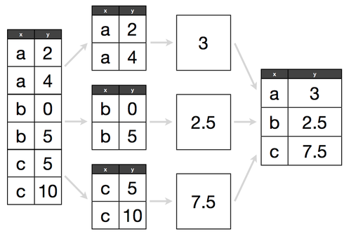

# (EDA)

## Objectives

>>* basic stats concepts
	>>* distributions
	>>* measures of central tendency
	>>* ways to handle null values and why choosing the right one is important
>>* groupby
	>> .agg()
	>> df.groupby('column').agg(['count', 'mean', 'max', 'min'])
>>* basic descriptive stats
	>>word frequency in the plot col?
	>>* binning (i.e. .cut())
    >>* sampling
    >>* correlation
    >>* relative frequencies with groupby / .value_counts()
    	>>* https://towardsdatascience.com/getting-more-value-from-the-pandas-value-counts-aa17230907a6

## Basic Stats

https://pandas.pydata.org/pandas-docs/stable/user_guide/computation.html

>> population vs. sample
>> descriptive statistics
>> What is a distribution?
	>> A histogram can often add visual context to these measures. Histograms visualize the data's **probability distribution**, which is a function showing how often the values for a variable occur within the population or sample.

>> Measures of Central Tendency
>> Measures of Variability (Spread)
>> Measuring Asymmetry
	>> skewness important bc stats requires vars to be 
>>Measuring Frequency
>> Simple test?

Min: The smallest value in the column
Max: The largest value in the column
Quartile: A quartile is one fourth of our data
First quartile: This is the bottom most 25 percent
Median: The middle value. (Line all values biggest to smallest - median is the middle!) Also the 50th percentile
Third quartile: This the the top 75 percentile of our data

`s.value_counts(self, normalize=False, sort=True, ascending=False, bins=None, dropna=True)` -- return a Series containing counts -- or, if normalize=True, relative frequencies -- of unique values
	* when bins=n, instead of counting unique values, group them into n half-open bins (similar to pd.cut())
`movies['Year'].value_counts(bins=10)`
^^ can you specify to bin Year into decades (i.e. discrete intervals of 10 years)
`titanic['Fare'].value_counts(bins=7)`

## Groupby

>>https://chrisalbon.com/python/data_wrangling/pandas_apply_operations_to_groups/
>>https://pandas.pydata.org/pandas-docs/stable/reference/groupby.html
https://realpython.com/pandas-groupby/#how-pandas-groupby-works

.groupby() multiple cols
.groups
>> .groupby(). <stat>()
>> .groupby().agg()
>> grouping by BINS for continuous variables
>> .groupby()

Grouby statements are particularly useful for a subsection-of-interest analysis. Specifically, zooming in on one condition, and determining relevant statstics.

`df.groupby(by=None, axis=0, level=None, as_index=True, sort=True, group_keys: bool = True, squeeze: bool = False, observed: bool = False)`
>>https://pandas.pydata.org/pandas-docs/stable/reference/api/pandas.DataFrame.groupby.html#pandas.DataFrame.groupby
by mapping, function, label, or list of labels
Used to determine the groups for the groupby. 
If by is a function, it’s called on each value of the object’s index. 
If a dict or Series is passed, the Series or dict VALUES will be used to determine the groups (the Series’ values are first aligned; see .align() method). 
If an ndarray is passed, the values are used as-is determine the groups. 
A label or list of labels may be passed to group by the columns in self. Notice that a tuple is interpreted as a (single) key.

1. Split a table into groups based on a specific attribute (e.g. Language)
2. Apply some operations to each of those smaller tables
3. Combine the results

It can be difficult to inspect movies.groupby('Genre') because it does virtually none of these things until you do something with the resulting object. 

"How the split-apply-combine chain of operations works
How to decompose the split-apply-combine chain into steps
How methods of a Pandas GroupBy object can be placed into different categories based on their intent and result" -- RealPython

>>Aggregation:
	>>df.groupby('column').agg(['count', 'mean', 'max', 'min'])
	>>df.groupby('')

**Aggregation** calculate some summary statistics for each group
**Meta** focuses on obtaining information about the resultant groups as opposed to the original dataframe

## Correlation

>>> x.corr(y)                     # Pearson's r
0.7586402890911867
>>> y.corr(x)
0.7586402890911869
>>> x.corr(y, method='spearman')  # Spearman's rho
0.9757575757575757
>>> x.corr(y, method='kendall')   # Kendall's tau

## Functions Featured

* **`.describe(include=np.object)`** -- return count, mean, standard deviation, min, max, & interquartile range (IQR); only includes numerical columns by default*
* **`s.value_counts()`** -- returns numerical frequency of each unique value in the Series
* **`s.mean()`** -- mean
* **`s.median()`** -- median
* **`s.min()`** -- minimum
* **`s.max()`** -- maximum
* **`s.iqr()`** -- interquartile range
* **`s.quantile(x)`** -- quantile
* **`df.rank(na_option='keep', )`** -- rank each 
* **`s.var()`** -- variance
* **`s.std()`** -- standard deviation
* **`s.mad()`** -- mean absolute variation
* **`s.skew()`** -- skewness of distribution
* **`s.sem()`** -- unbiased standard error of the mean
* **`s.kurt()`** -- kurtosis
* **`s.cov()`** -- covariance
* **`s.corr()`** -- Pearson Correlation coefficent
* **`s.autocorr()`** -- autocorelation
* **`df.sample(frac = 0.5)`** - randomly select a fraction of rows of a DataFrame
* **`df.sample(n=10)`** - randomly select n rows of a DataFrame
* **`s.cumsum()`** -- cummulative sum
* **`s.comprod()`** -- cumulative product
* **`s.cummin()`** -- cumulative minimum

