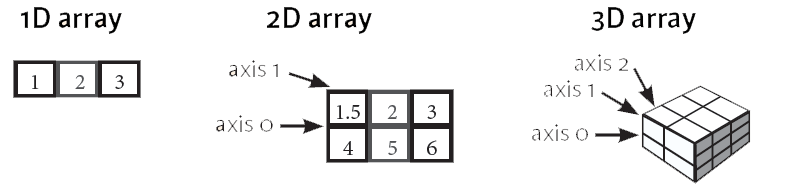
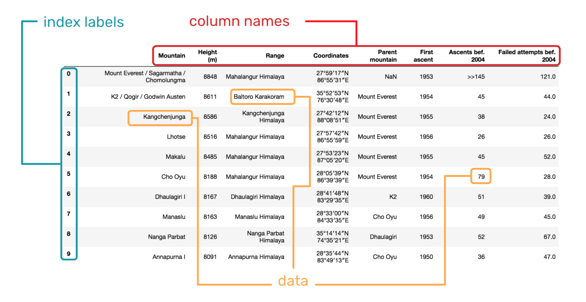

# Foundational Pandas Objects


### **Core Objectives**

* What can you do with the Pandas library?
* What are ndarrays and their distinctive qualities?
* What are Series objects and how do you construct them?
* What are Dataframe objects and how do you construct them?
* What are Index objects and why are they unique?

## Introduction 

**Pandas** is an open-source Python library of data structures and tools for exploratory data analysis (EDA). Pandas primarily facilitates acquisition, cleaning, formatting, and manipulating. Used in tandem with NumPy, Matplotlib, SciPy, and other Python libraries, Pandas is an integral part of practicing data science. Its core capabilities include: 

* Robust IO tools to read from flat files (CSV and TXT), JSON, XML, Excel files, SQL tables, and other databases.
* Axis reindexing and hierarchical labeling of matrix-like `dataframes`
* Data manipulation, by applying `vectorized operations` or by iterating through datasets
* Handling duplicates and missing data
* Conditional queries for sorting, filtering, & subsetting
* Merging & joining datasets
* Reshaping, transforming, & pivoting datasets
* Basics statistics
* Time-series functionality, e.g. date shifting, frequency conversions, & moving window statistics

## Importing Data Science Libraries

The first thing you have to do start a new analysis is import whichever data science libraries you plan to use. Pandas is built on top of NumPy, so you have to import that separately every time you plan to use pandas. Notice the standard abbreviations used for later references of the libraries.

```python
import numpy as np 
import pandas as pd
import matplotlib.pyplot as plt
import seaborn as sns
```

*As a bonus, I've added the notation for importing the other two libraries to be used in this class - matplotlib and seaborn. More to come on these later!*

## NumPy ndarray Objects

Pandas is built on top of NumPy, so before  new users should first understand one NumPy data object that often appears within Pandas objects - the **ndarray, or N-dimensional array**.

`Ndarrays` are deceptively similar to the more general Python `list` type we've been working with. An `ndarray` type is a group of elements, which can be accessed and updated using a zero-based index. Sounds exactly like a `list`, right? 

```python
import numpy as np

listA = [1, 2, 3]
listB = ['a', 'b', 'c']

arrayA = np.array([1, 2, 3])
print(listA) # [1, 2, 3]
print(arrayA) # [1 2 3]

listB = ['a', 'b', 'c']
arrayB = np.array(listB)
print(listB) # ['a', 'b', 'c']
print(arrayB) # ['a' 'b' 'c']
```

Wrong. You don't need to get caught up on the syntactical details of ndarrays for this course. However, you should understand the three key differences between ndarrays and lists: 

### 1) All ndarrays must be homogenous.

All elements in an ndarray must be the same data type (e.g. integers, floats, strings, booleans, etc.). If you try to enter data that is not homogenous, the `.array()` function will force unity of data type.

```python
import numpy as np

bad_array1 = np.array([1, 'b', True])
print(bad_array1) # ['1', 'b', 'True']

bad_array2 = np.array([1, False])
print(bad_array2) # [1 0]
```

### 2) An ndarray can have multiple dimensions.



ndarrays have a parameter called `ndmin`, which allows you to specify the number of dimensions you want for your array when you create it. Each dimension prints on its own line, so the ndarray looks more like a *grid* than a single list. Having n-dimensions also means that when you reference ndarray values by index, you need to use multiple index positions.

**2-D array: 3x3**

```python
dim1 = np.array([1, 2, 3]) 
dim2 = np.array([4, 5, 6])
dim3 = np.array([7, 8, 9])

arrayC = np.array((dim1, dim2, dim3))
print(arrayC) 
"""
[[1 2 3]
 [4 5 6]
 [7 8 9]]
"""
```

**3-D array: 2x3x3**

```python
arrayD = np.array((([1, 2, 3], [4, 5, 6], [7, 8, 9]), ([1, 2, 3], [4, 5, 6], [7, 8, 9])), ndmin = 3)
print(arrayD)
"""
[[[1 2 3]
  [4 5 6]
  [7 8 9]]

 [[1 2 3]
  [4 5 6]
  [7 8 9]]]
"""
```

### 3) ndarrays are designed to handle `vectorized` operations

In other words, if you apply a function to an ndarray object, the program will perform said function on *each* item in the array individually. Depending on the operand, if you apply a function to a list, either the function will be performed on the list object *as a whole* or you will get a TypeError. As a bonus, these vectorization capabilities also allow ndarrays take up less memory space and run faster.

```python
list1 = [3, 5, 7]
array1 = np.array([3, 5, 7])

print(list1 * 10) # [3, 5, 7, 3, 5, 7, 3, 5, 7, 3, 5, 7, 3, 5, 7, 3, 5, 7, 3, 5, 7, 3,5, 7, 3, 5, 7, 3, 5, 7]
print(array1 * 10) # [30 50 70]

# print(list1 + 1) # TypeError
print(array1 + 1) # [4 6 8]
```
## Pandas Series Objects

A **Series** object from the Pandas library is a 1-D ndarray that has been streamlined for data processing.

* All the values in a Series must homogenous.
* A Series is always 1-D.
* Series support vectorized operations
* By default, the `index` parameter assigns an zero-based index. Alternatively, you can assign custom index labels to a Series. On this front, you can think of a Series kind of like a dict.

The general syntax for creating a Series is `s = pd.Series(data, index, dtype)`. Using this syntax, you can instantiate a Series from a single scalar or boolean value, a list, an ndarray, or a dict.

**Series from a single scalar/boolean value, using a custom index**

```python

s_scalar = pd.Series(1, index=['a', 'b', 'c', 'd', 'e'])
ubstitute 
s_boolean = pd.Series(False, index=['a', 'b', 'c', 'd', 'e'])

print(s_scalar)
print(s_boolean)
```

**Series from a list, using default indexing**

```python
s_list = pd.Series(['red','orange','yellow','green','blue','purple'])
print(s_list)
```

**Series from an ndarray, using default indexing**

```python
s_ndarray = pd.Series(np.ndarray(['red', 'orange' 'yellow','green','blue','purple']))
print(s_ndarray)
```

**Series from a dict, using implicit custom index**

```python
my_dict = {'c': 15, 'B': 20, 'a': 10}
s_dict = pd.Series(my_dict)
print(s_dict)
```

## Pandas DataFrame Objects



A **DataFrame** is a 2-D ndarray that has been streamlined for data processing. It's like a more dynamic spreadsheet. It accepts many different data types as values, including strings, arrays (lists), dicts, Series, and even other dataframes. Most of the time, you'll create a dataframe indirectly in one of two ways. First, you could import data from a file or database. Alternatively, you could manipulate an existing dataframe and store that new version in its own variable. 

The syntx for creating a dataframe manually is `df = pd.DataFrame(data, index, columns)`. This is syntactically similar to creating a series, with two notable differences. First, there is no `dtype` parameter for a dataframe, since each column could contain data of a different type. Second, a series is 1-D, so it only needs an index for axis 0. Since a dataframe is 2-D, it includes another parameter called `columns` for labeling axis 1.

Constructing a DataFrame manually is a little more complex because you have to ensure the values for the rows and columns align correctly. The examples below illustrate multiple different ways to create the same dataframe. 

1) Specify column labels directly within the `data` parameter by passing in a **dict of lists and/or ndarrays**. 


```python
d1 = {
'a': [4, 5, 6], 
'b': np.array([7, 8, 9]), 
'c': [10, 11, 12]}

df1 = pd.DataFrame(data = d1, index = ['foo', 'bar', 'baz'])
df1
```

2) Specify both the index AND column labels directly within the `data` parameter by passing in a **dict of Series**. 

```python
d2 = {
'a': pd.Series([4, 5, 6,], index = ['foo', 'bar', 'baz']), 
'b': pd.Series([7, 8, 9], index = ['foo', 'bar', 'baz']), 
'c': pd.Series([10, 11, 12], index = ['foo', 'bar', 'baz'])}

df2 = pd.DataFrame(data = d2)
df2
```

3) Specify the values in the `data` parameter in the form of a 2-D ndarray. Then separately specify the index and column labels in their corresponding parameters.

```python
df3 = pd.DataFrame(
[[4, 7, 10],
[5, 8, 11],
[6, 9, 12]],
index=['foo', 'bar', 'baz'],
columns=['a', 'b', 'c'])

df3
```

## Pandas Index Objects

Pandas considers an `Index` to be its own object class. In the Pandas docs, an `Index` object is formally defined as an "immutable ndarray implementing an ordered, sliceable set". As we just saw, the main purpose of a Pandas `Index` object is to store the labels for each axis in a `Series` or `Dataframe`. The values *do NOT have to be unique*. However, to avoid ambuity in your data structure, you should always use unique values when creating a custom index.

We learned about the concept of **index positioning** back in the unit on regular Python `lists`. To access a specific item in a regular Python `list`, you reference its numerical position in the list. In a Pandas Series, you can access each item by referencing its `Index` label OR its numerical index position. The same goes for accessing the rows of a dataframe. The scenario below explains the functional difference index positioning and `Index` labels.

Here's a Series containing names of people:

|                  | Brandi| Zoe | Sasha | Aleksander | Olaf  |
|:----------------:|:-----:|:---:|:-----:|:----------:|:-----:|
|   Index label    |  0    |   1 |   2   |      3     |   4   |
| *index position* |  0    |   1 |   2   |      3     |   4   |

Now, let's say you alphabetize the Series by sorting the values...

|                  | Aleksander | Brandi | Olaf | Sasha  |  Zoe  |
|:----------------:|:----------:|:------:|:----:|:------:|:-----:|
|   Index Label    |  3         |   0    |   4  |    2   |   1   |
| *index position* |  0         |   1    |   2  |    3   |   4   |

Notice how the index position doesn't change, but the `Index` labels follow their corresponding values. This is extremely helpful in data analysis because, no matter how you've sorted or sliced the data, each item can always be accessed by the same `Index` label.